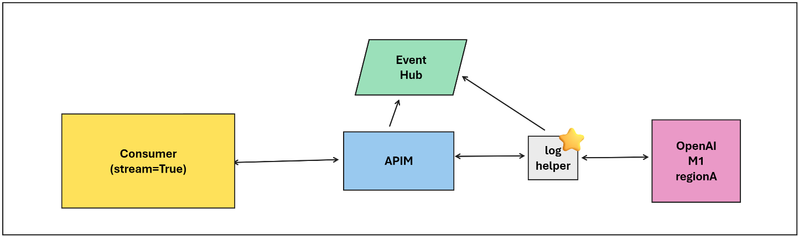

# openai-log-helper-proxy
The OpenAI Log Helper Proxy is a sample app that can be used to help capture the OpenAI Completion Tokens when using the `steam=True` part of the SDK.

If you are wanting to capture the response of an OpenAI call Microsoft recommends a pattern based on https://github.com/Azure-Samples/openai-python-enterprise-logging which works great when not streaming. It is possible to use APIM policy to log to eventhub the response and additional information to be used in a charge back model or understanding model responses over time. 

Unfortunately, when you try to do something with the response body in an APIM policy while `steam=True` it buffers the response https://learn.microsoft.com/en-us/azure/api-management/how-to-server-sent-events which negates the benefits of using the streaming response.

Enter this project! 

Underneath the covers this project utilizes [OpenResty](https://openresty.org/en/) to reverse proxy the OpenAI endpoint and log the response back to a file. Then there is a custom python app that tails the log and sends the information off to an Event Hub! 